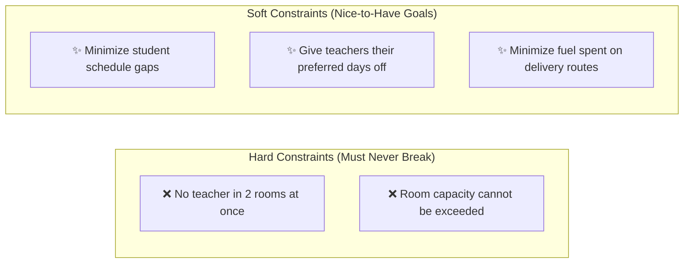
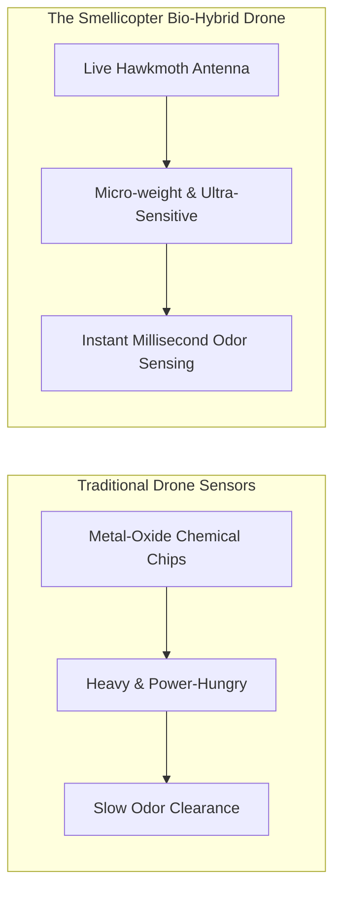
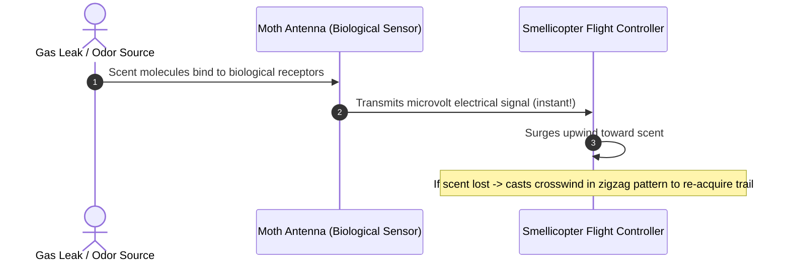

Today, almost every headline in tech revolves around Generative AI, chatbots, and large language models. While these tools are fantastic at writing text, analyzing images, and writing code snippets, there is an entire branch of engineering that is equally critical yet receives far less spotlight: **Combinatorial Optimization** and **Bio-Inspired Engineering**.

If you ask an AI chatbot to write a story or summarize an article, it excels. But if you ask it to schedule 500 hospital nurses across 3 shifts over 6 months—while respecting legal working hours, time-off requests, skill certifications, and fair rotation—it quickly falls apart.

Why? Because some problems aren't about language prediction; they are **mathematical puzzles with strict, unbreakable rules**.

---

## The Puzzle: Combinatorial Optimization

Consider planning a high school timetable:
- 50 teachers, 800 students, 35 classrooms.
- No teacher can teach two classes at once.
- Students must not have 3-hour gaps in the middle of their day.
- Science classes must occur in dedicated laboratories.

The number of potential combinations is larger than the number of atoms in the known universe. You cannot simply check every possibility one by one.

This field is called **Operations Research (OR)**. It powers everything from how Amazon routes delivery vans to how airlines assign flight crews and how factories schedule assembly lines.

---

## How Constraint Solvers Work: Timefold

One leading tool in this space is **[Timefold](https://timefold.ai/)** (an open-source AI constraint solver). Instead of guessing like a chatbot, Timefold categorizes problems into two types of rules:

### The Solver Process:
1. **Start with a Draft Plan:** Rapidly assign classes using smart construction rules.
2. **Score the Solution:** Check violations. Any broken hard rule gives a score penalty (e.g., `-1 Hard`). Any unfulfilled preference gives a soft penalty (e.g., `-10 Soft`).
3. **Continuous Swapping:** The solver tests thousands of intelligent adjustments per second using algorithms inspired by physics and biology (like **Simulated Annealing** and **Tabu Search**), steadily refining the schedule until it finds an optimal result.

---

## When Nature Solves Engineering: The Smellicopter

Just as mathematics helps us solve scheduling puzzles, nature helps us solve hardware and sensor bottlenecks.

Consider search-and-rescue robotics: after an earthquake or gas leak, small drones must navigate collapsed buildings and find the source of hazardous odors or survivors.

Human-made gas sensors are heavy, consume a lot of battery power, and take several seconds to clear scent molecules.

To solve this, researchers at the University of Washington created the **Smellicopter** — an autonomous, palm-sized drone that uses a **real antenna from a hawkmoth (*Manduca sexta*)**:

1. **Unmatched Sensitivity:** The moth's antenna can detect single molecules of scent in the air within milliseconds.
2. **Ultra-Lightweight:** It weighs a fraction of a gram and requires virtually zero battery power to operate.
3. **Bio-Inspired Navigation:** Rather than relying on power-hungry GPS or LIDAR, the drone uses a moth-like **"cast-and-surge"** flight strategy (surging into the wind when it smells something, zig-zagging crosswind when it loses the trail).

---

## Nature as the Master Blueprint

The Smellicopter and constraint solvers are part of a broader engineering philosophy called **Biomimicry** — looking at biological evolution to solve technical hurdles:

| Natural Inspiration | Everyday Engineering Application |
| :--- | :--- |
| **Kingfisher Bird Beak** | The aerodynamic nose cone of Japan's bullet trains (*Shinkansen*), designed to eliminate sonic booms when exiting tunnels. |
| **Bat Echolocation** | High-precision sonar navigation in autonomous submarines and medical ultrasound imaging. |
| **Ant Foraging Trails** | **Ant Colony Optimization (ACO)** algorithms used by telecommunications networks to route internet packets efficiently. |
| **Natural Selection** | **Genetic Algorithms** used to optimize aircraft wing designs and energy grids. |

---

## Conclusion

The future of technology is not just about building larger language models. It is about combining the right tools for the right jobs:
- **Generative AI** for conversational interfaces, creative writing, and text processing.
- **Mathematical Optimization (like Timefold)** for bulletproof scheduling, logistics, and resource allocation.
- **Bio-Inspired Engineering** for hyper-efficient sensors, aerodynamics, and robotic navigation.

When we look beyond the hype cycle, some of the most elegant solutions are already mapped out in mathematics and nature.
