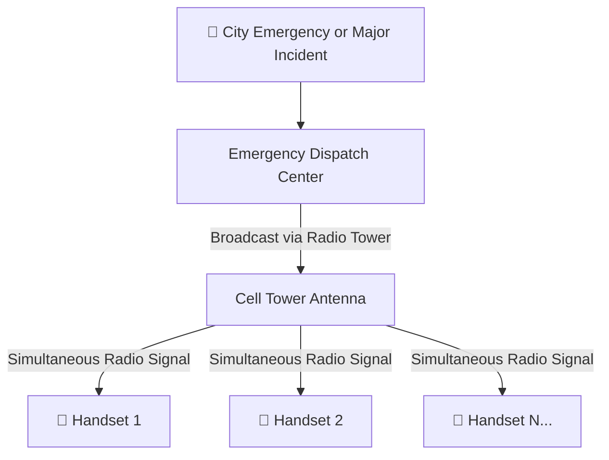
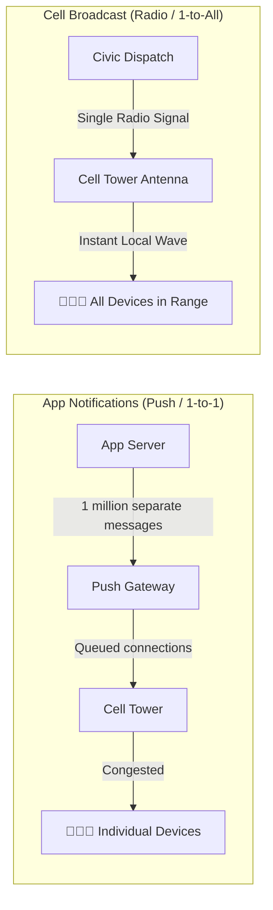
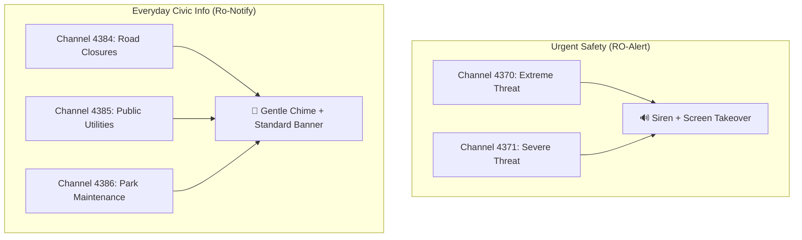
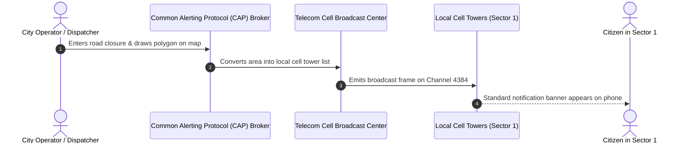

We all know the sound: an ear-splitting siren blaring from every phone in the room, warning us of an impending flash flood, severe storm, or wild animal sighting. That is **RO-Alert** doing its job.

It is one of the most effective communication tools in Romania. It reaches every phone in a designated area within seconds — no app download, no account creation, and no internet connection required.

But think about the minor disruptions that make city life frustrating every week:
- A major marathon shuts down the main avenue you are about to drive on.
- A water main bursts, cutting off water supply to three neighborhood blocks.
- A municipal team conducts scheduled pest-control spraying in the park where you were about to take your children.

Today, you only find out after running into the roadblock or reading about it hours later on social media. 

Could the technology behind RO-Alert be adapted for everyday city life without causing panic? The answer lies in how cell networks actually broadcast messages.

---

## The Megaphone vs. The Phone Call

To understand why this is possible, we have to look at the difference between **ordinary app notifications** and **Cell Broadcast**.

### 1. Ordinary Apps (1-to-1 Phone Calls)
When an app sends a notification (via Apple or Google servers), it has to create an individual digital connection to every single smartphone. If 500,000 people are in the same neighborhood, the network tries to deliver 500,000 separate messages simultaneously. During emergencies or crowded events, this causes massive network slowdowns.

### 2. Cell Broadcast (A Radio Megaphone)
RO-Alert uses **Cell Broadcast Service (CBS)**. Instead of sending individual messages to each phone, the cell tower simply broadcasts a single radio frequency packet to the area — exactly like a FM radio station transmitting sound.
- Every phone tuned to that frequency receives the message at the exact same millisecond.
- The tower never needs to know who you are, your phone number, or where you are going.
- It never gets congested, even if 2 million people are standing under the same cell tower.

---

## Enter "Ro-Notify": The Quiet Channel

The biggest fear people have about expanding RO-Alert is **alert fatigue**: nobody wants a deafening siren waking them up at 7:00 AM just to say a street is closed for paving.

The good news is that the European standard behind RO-Alert (**ETSI TS 102 900**) already supports multiple **Message Channels**:

By assigning everyday civic announcements to **informational channels**:
1. **No Siren:** Messages arrive as a standard, gentle notification banner.
2. **Respects Silent Mode:** If your phone is set to silent or Do Not Disturb, it stays silent.
3. **Customizable:** You can choose which topics to subscribe to in your phone's built-in emergency/broadcast settings.

---

## Why Not Just Build Another Mobile App?

City halls often propose building a new municipal mobile app for news. In practice, app-based civic alerts suffer from three major issues:

| Feature | Municipal Mobile App | Built-in Cell Broadcast (Ro-Notify) |
| :--- | :--- | :--- |
| **Reach** | Only the ~5-10% of residents who download it | 100% of people in the affected area (including visitors) |
| **Battery Life** | Drains battery using continuous background GPS tracking | **0% extra drain** (the phone's cellular chip is already listening) |
| **Privacy** | App tracks user location on a server database | **100% anonymous** (tower transmits outward; no user data is collected) |
| **Reliability** | Fails when mobile data is turned off or congested | Works even without mobile data or internet access |

---

## How It Could Work in Practice

Imagine a simple, standardized municipal dashboard:

When local authorities schedule tree pruning, water maintenance, or a parade, they draw the affected perimeter on a map. The system routes the alert strictly to the cell antennas covering that neighborhood.

---

## Summary

We already have world-class cell broadcast infrastructure operating nationwide. By adding a secondary, non-intrusive civic channel, Romania could transform emergency infrastructure into an everyday civic assistant — making cities smarter, safer, and much easier to navigate.
