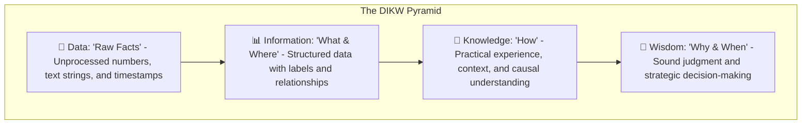
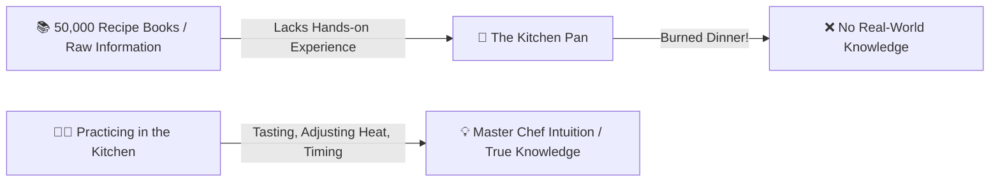
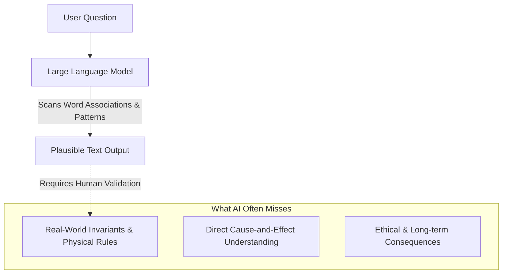
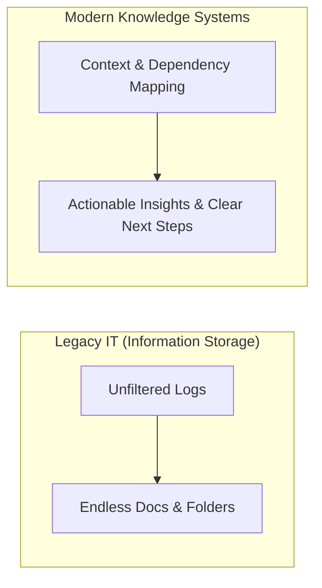

We often hear the famous phrase: *"Information is power."*

In the digital era, we take this for granted. We have search engines that index billions of web pages, smartphones that deliver instant notifications on any topic, and AI tools capable of generating essays on demand.

Yet, having immediate access to infinite information often leaves us feeling more overwhelmed rather than more enlightened. In software engineering, we see this every day: systems that record millions of log lines per minute, yet engineers still spend hours trying to figure out why an outage happened.

Why is there such a huge gap between **having information** and **understanding what to do**?

---

## The DIKW Pyramid: From Raw Signals to True Wisdom

In computer science and philosophy, human and digital understanding is categorized using the **DIKW Pyramid** (Data, Information, Knowledge, Wisdom):

Let's break these down with a simple comparison:

| Stage | In Everyday Life (Cooking) | In Software Engineering |
| :--- | :--- | :--- |
| **Data** | `200`, `flour`, `30`, `Celsius` | `10.0.0.4`, `504`, `820ms`, `14:22:01` |
| **Information** | A recipe card: *"Bake 200g of flour at 180°C for 30 minutes."* | A metric graph: *"API endpoint `/checkout` latency spiked to 820ms at 14:22."* |
| **Knowledge** | Knowing how dough feels when kneaded properly and when the crust is truly done. | Knowing that the latency spike was caused by a database lock during a user table migration. |
| **Wisdom** | Deciding *what* meal to prepare to nourish a sick friend based on context and care. | Deciding *whether* to rebuild the architecture or prioritize security and team stability. |

---

## The Frying Pan Problem

Imagine downloading an offline database containing every recipe ever published across human history. You now possess near-infinite culinary **information**.

Does having all those recipes make you a master chef? Not at all. If you have never held a pan, regulated stove heat, or smelled when garlic is about to burn, the recipe alone cannot prevent a culinary disaster.

**Information is just static text and numbers.** Knowledge is the living bridge that connects information to real-world action.

---

## Why Modern AI Has Information, But Not Wisdom

Modern Large Language Models (LLMs) and search tools are incredible at retrieving and synthesizing information. But they operate primarily on **pattern matching and statistical likelihood**:

An AI can write a convincing explanation of how a complex financial market or distributed computer cluster works. However, it doesn't possess the situational awareness or causal intuition to anticipate unexpected edge cases without human verification.

---

## Moving Toward "Knowledge Technology"

To build systems that genuinely help humans make better decisions, we need to move beyond simple information storage toward **Knowledge Technology**:

1. **Context-Rich Systems:** Instead of dumping thousands of raw alerts, modern tools should map cause and effect (e.g., *"Service A is slow because Database B is running low on disk space"*).
2. **Actionable Feedback:** An alert or report is only valuable if it clarifies the exact decision an engineer or manager needs to make.
3. **Executable Knowledge:** Making documentation live and tested (such as automated tests that verify system rules continuously) rather than letting static documents gather dust.

---

## Key Takeaways

- **Access to information is a tool, not an outcome:** Having all the data in the world is useless if you don't have the context to interpret it.
- **Practice builds knowledge:** Just like cooking, real understanding in engineering and life comes from hands-on experimentation, debugging, and learning from mistakes.
- **Focus on clarity over volume:** The goal of modern technology shouldn't be to generate *more* text or more dashboards, but to distill raw data into clear, actionable insight.
